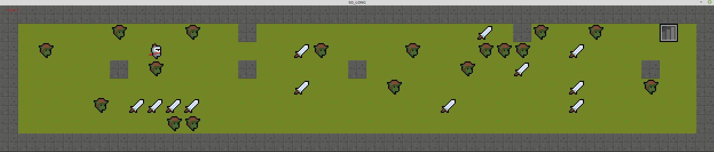

# so_long

### Description
A basic graphic project for Linux (with some manipulation can be launched at MacOS) on MiniLibX.
Requires xorg, x11 and zlib.

### How to launch (Linux)
    
1) Install required libraries:

    sudo apt-get update && sudo apt-get install xorg libxext-dev zlib1g-dev
2)  Build executable file with command:

    make all

or

    make bonus

Bonus is much more interesting.

3. Start the game with predefined map as argument.

        ./so_long  map.ber
4. Enjoy!